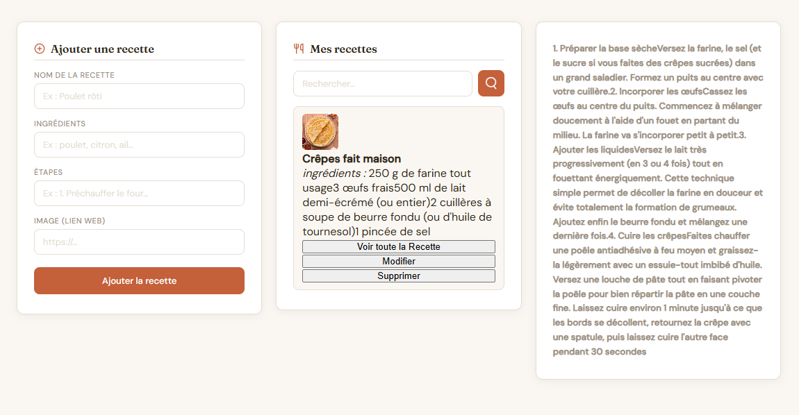

## Aperçu



# 🍴 Recipes App

Une application web CRUD pour gérer ses recettes de cuisine, sans serveur ni installation.

---

## Fonctionnalités

Opérations CRUD complètes sur les recettes :

- **Create** — ajouter une recette (nom, ingrédients, étapes, image)
- **Read** — consulter la liste et le détail d'une recette
- **Update** — modifier une recette existante
- **Delete** — supprimer une recette de la liste

---

## Structure du projet

```
recipes-app/
└── src/
    ├── index.html   # Interface utilisateur
    ├── style.css    # Mise en forme
    ├── main.js      # Logique CRUD
    └── img/
        └── search.png
```

---

## Lancer le projet

Ouvrir `src/index.html` directement dans un navigateur. Aucune installation requise.

```bash
# Optionnel : serveur local
npx serve src
```

---

## Technologies

- HTML5 / CSS3
- JavaScript vanilla
- [Lucide Icons](https://lucide.dev) — icônes SVG open-source
- [Fraunces + DM Sans](https://fonts.google.com) — Google Fonts

---

## Licence

Projet libre — usage personnel et éducatif.
